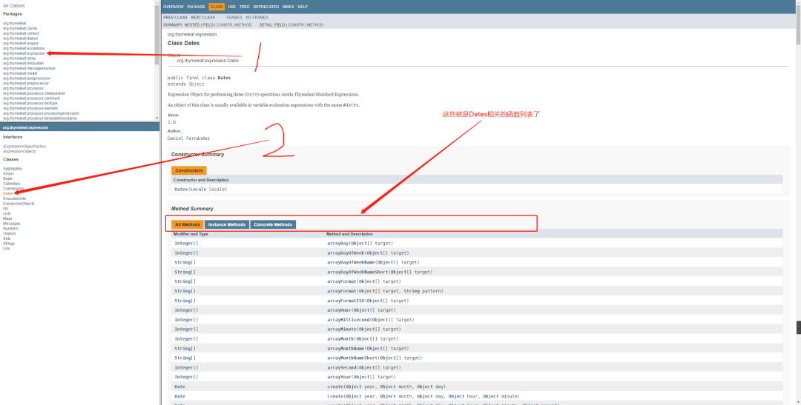

前言

现在虽然Vue、React等前端框架盛行，但是部分需要SEO的页面，还是得用thymeleaf之类的模板引擎来渲染。thymeleaf的官方文档，写的太过详细，显得比较啰嗦。本文主要是把thymeleaf官方的英文文档，结合作者自己的使用经验，整理成了一篇可以用来速查的中文教程，方便大家。其中，一些使用起来不方便或使用频率低的语法，本文直接跳过不写了。

一、thymeleaf赋值

th:text

`th:text`是最常用的语法，用来将一个字符串赋值到对应的标签内。比如：`<a th:text="${car.color}"></a>`，意思就是把car这个对象的color填入到a标签内。不过要注意，这里的字符串，不能包含HTML标签，会被转义或过滤。

th:utext

`th:utext`类似上面的`th:text`，区别是`th:utext`输出的字符串，是可以包含HTML标签、字符的。比如你要把一段HTML字符串填入一个div中，那就必须使用`th:utext`了。


属性赋值

例如：`th:src`、`th:class`、`th:style`等等，和`th:text`类似的用法，只不过赋值到了对应HTML标签的属性上。PS：thymeleaf支持的属性赋值太多了，有很多使用频率很低。所以记忆常用的就可以，遇到生僻的属性需要赋值，可以先用`th:属性`试试，如果不支持或报错，就用下面的自定义属性赋值来解决。


自定义属性赋值

th:attr`主要用来给HTML标签上，我们自定义的属性赋值。比如`<div th:attr="data-id=${id}"></div>

#### 符串拼接

~~~html
<a th:text="'hello world' + ${car.color}">123</a>或者<a th:text="${'hello world' + car.color}">123</a>，或者两个变量拼接<a th:text="${a} + ${b}"></a>
~~~

```html
<span th:text="|Welcome to our application, ${user.name}!|">
```


格式化日期


~~~html
<h1 th:text="${#dates.format(time,'yyyy-MM-dd HH:mm:ss')}"></h1>，其中time是后端的变量，类型是Java的Date。
~~~


内置对象

可以理解为，springboot中的很多基础对象，无需通过model赋值，即可在thymeleaf模板中使用。

#ctx 上下文对象
#vars 同 #ctx，表示上下文变量
#locale 上下文本地化（特定的地理区域）变量，可参考 java.util.Locale
#request HttpServletRequest 对象，可参考 javax.servlet.http.HttpServletRequest
#response HttpServletResponse 对象，可参考 javax.servlet.http.HttpServletResponse
#session HttpSession 对象，可参考 javax.servlet.http.HttpSession
#servletContext ServletContext 对象，可参考 javax.servlet.ServletContext
以request举例，用法：


~~~html
<!-- HTTP/1.1 -->
<p th:text="${#request.protocol}"></p>
<!-- http -->
<p th:text="${#request.scheme}"></p>
<!-- localhost -->
<p th:text="${#request.serverName}"></p>
<!-- 8080 -->
<p th:text="${#request.serverPort}"></p>
<!-- GET -->
<p th:text="${#request.method}"></p>
<!-- /standard-expression-syntax/variables -->
<p th:text="${#request.requestURI}"></p>
<!-- http://localhost:8080/standard-expression-syntax/variables -->
<p th:text="${#request.requestURL}"></p>
<!-- /standard-expression-syntax/variables -->
<p th:text="${#request.servletPath}"></p>
<!-- java.util.Collections$3@203646fe -->
<p th:text="${#request.parameterNames}"></p>
<!-- {q=[Ljava.lang.String;@3308c69f} -->
<p th:text="${#request.parameterMap}"></p>
<!-- q=expression -->
<p th:text="${#request.queryString}"></p>

~~~

二、thymeleaf逻辑控制

th:if

~~~html
<p th:if="${a} ne null">hello world</p>意思是：当变量a不等于null时，显示这个p标签。最新版的thymeleaf和Springboot中，th:if里面的大于、小于、等于、不等于已经不需要再使用eq、ne、gt、lt等符号了，直接用java代码里的>、!=之类的就可以了。
~~~


三元表达式

~~~html
例如<div th:text="${car}=='BMW'?'豪车':'买菜车'"></div>，和Java中的三元表达式类似。部分情况下，三元表达式能很好的弥补thymeleaf只有if没有else的尴尬局面。

~~~


th:switch

直接看代码就理解了

~~~html
<div th:switch="${car.color}">
      <p th:case="'yellow'">汽车是黄色的</p>
      <p th:case="'red'">汽车是红色的</p>
</div>
~~~

th:each

~~~html
循环，使用频率非常高。用来将后端传过来的List等，遍历输出。重点提示：th:each所在的标签本身，也会循环。比如你要实现一个ul标签里，循环li标签。那么th:each应该写在li标签上。

<li th:each="articleData,k:${hotArticle}">
    <span th:text="${k.index}+${articleData.title}">基于java jsp+mysql+Spring+mybatis的SSM二手交易网站设计和实现【建议收藏】</span>
</li>
上面的代码中，后端传过来的List是hotArticle，articleData相当于hotArticle这个List里的一项。需要特别注意的是th:each里面那个k，这个变量里包含了很多常用的东西index,count,size,current,even,odd,first,last，比如k.index就是循环的index，从0开始。有点像Java代码里for循环for(int i=0;i<100;i++)里面的i。
~~~

三、thymeleaf在JavaScript、CSS中赋值（内联）

赋值给JavaScript变量


一定要在JavaScript的<script>标签里添加th:inline="javascript"，然后用[[]]来包围后端变量赋值即可。例如：<script th:inline="javascript">  var a = [[${msg}]]  </script>

赋值给css style

类似赋值给JavaScript，也一定要在<style>标签里添加th:inline="css"，然后就可以使用[[]]包围的变量，在css任意地方使用了。可以是css的class，也可以是具体的css属性值。例如：

~~~html
<style th:inline="css">
    .[[${classname}]] {
        text-align: [[${align}]];
    }
</style>
~~~


四、模板操作

模板操作逐渐被淘汰了，主要作用是一些公共页面HTML代码片段的提取，比如header、footer之类的。随着现在webpack等前端工作流的兴起，使用这些工具就可以达到HTML公共代码片段的随处引用。所以，模板操作这里就不讲了。


五、预定义处理函数

就是thymeleaf内置的各种函数，比如日期格式化、数字四舍五入、字符串截取、查找、拼接等等。这块根据实际经验，建议也不要大规模应用。有需要数据处理的场景，尽量让后端完成。因为HTML模板中，各种单引号、双引号互相包含，各种标签缩进嵌套等等，很容易造成一些书写上的错误，并且不一定会报错被发现。在HTML代码中大量使用逻辑控制，是一个风险很高的操作。

所以本文尽量只介绍影响数据展示，但不改变数据值的常用预处理：

数字前方补零

~~~html
${#numbers.formatInteger('123',4)}结果是0123
~~~

千分位处理

~~~html
${#numbers.formatInteger('1000',2,'COMMA')}" 效果1,000，COMMA替换为WHITESPACE，就可以使用空格分隔。
~~~

生成数组-常用于循环输出一些相似数据

~~~html
<div th:each="num : ${#numbers.sequence(0,4)}" >
    <p th:text="${num}"></p>
</div>
~~~

效果如下：

~~~html
<div><p>0</p></div>
<div><p>1</p></div> 
<div><p>2</p></div>
<div><p>3</p></div>
<div><p>4</p></div>
~~~


字符串判空(null或长度=0)

${#strings.isEmpty(name)}，返回值是Boolean

默认值设置

${#strings.defaultString(text,'该值为null')}，当text为null时，使用默认值。

大小写转换

~~~html
${#strings.toLowerCase('ABC')}和${#strings.toUpperCase('abc')}
~~~

获取字符串长度

~~~html
${#strings.length('abc')}
~~~


还有很多thymeleaf函数可以用来处理后端赋值的变量，但是实际很少使用。主要原因就是上面提到的风险和记忆起来实在困难。thymeleaf的很多语法和java类似，有些又不太一样，所以记忆起来很费劲。

判断list是否为空

~~~html
List不为空：th:if="${not #lists.isEmpty(relationData)}"
List为空：th:if="${#lists.isEmpty(relationData)}"
获取List的size：${#lists.size(data)}
判断list是否包含某个元素：${#lists.contains(item)}，返回值是boolean
其中，relationData是java传递过来的List数组。
~~~


thymeleaf map相关操作

~~~html
map不为空：${#maps.isEmpty(map)}，返回值是boolean
获取map的size：${#maps.size(map)}，返回值是int
判断map是否包含某个key：${#maps.containsKey(map,key)}，返回值是boolean
判断map是否包含某个value：${#maps.containsValue(map,value)}，返回值是boolean
~~~


六、预定义函数查询方法

预定义处理函数还有很多很多，这里就不一一列举了。下面给大家提供可以查询这些函数的链接以及使用方法。thymeleaf函数文档，https://www.thymeleaf.org/apidocs/thymeleaf/3.0.0.RELEASE/index.html?overview-summary.html 

使用方法如下图所示：

