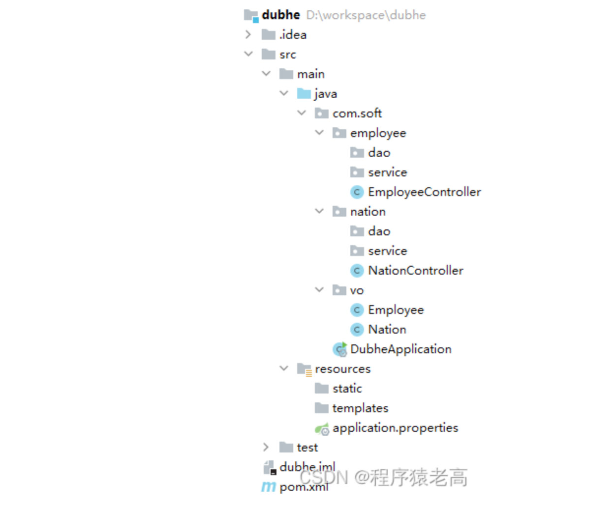
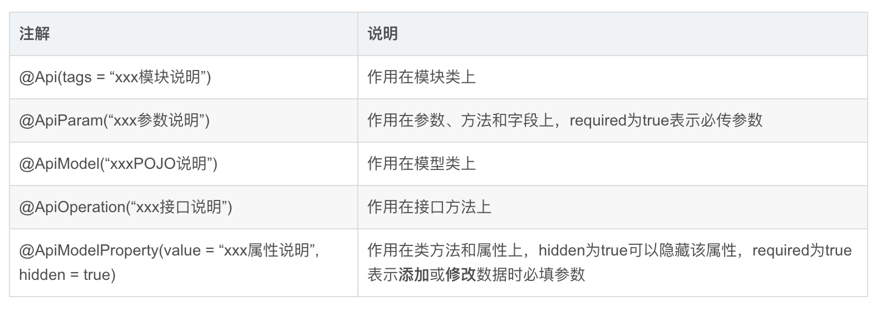
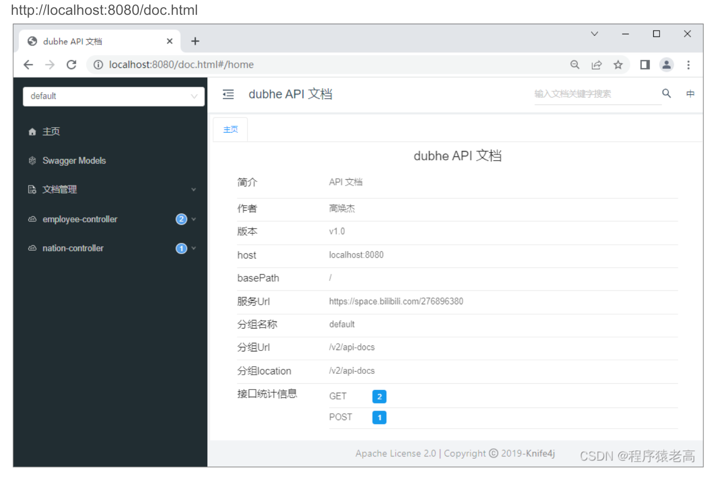

（一）、准备
1、SpringBoot项目

说明：前后端分离前提下，前端是一个独立项目，因此该SpringBoot无需添加Thymeleaf依赖！

2、vo类

Employee类：

    package com.soft.vo;
    
    import java.util.Date;
    
    public class Employee {
        private String id;//主键
        private String userName;//用户名
        private String password;//密码
        private String realName;//姓名
        private String nationId;//民族id
        private int role;//角色 1-管理员 2-普通员工
        private int status;//在职状态 1-试用 2-在职 3-离职
        private String mobile;//手机号
        private String address;//家庭地址
        private Date createTime;//创建时间
        private Date updateTime;//修改时间
        
        ...省略setter和getter
    }

1
Nation类：

    package com.soft.vo;
    
    import java.util.Date;
    
    public class Nation {
    private String id;//主键
    private int level;//级别
    private String name;//名称
    private Date createTime;//创建时间
    private Date updateTime;//修改时间
    
    public Nation(String id, int level, String name, Date createTime, Date updateTime) {
        this.id = id;
        this.level = level;
        this.name = name;
        this.createTime = createTime;
        this.updateTime = updateTime;
    }
    
    ...省略setter和getter
    }

3、controller类
EmployeeController类：

    package com.soft.employee;
    
    import com.soft.vo.Employee;
    import org.springframework.web.bind.annotation.RequestMapping;
    import org.springframework.web.bind.annotation.RestController;
    
    import java.util.Date;
    import java.util.HashMap;
    import java.util.Map;
    import java.util.UUID;
    
    @RestController
    @RequestMapping("/employee")
    public class EmployeeController {
    
    @RequestMapping("/save.do")
    public Map<String,Object> save(Employee employee){
        Map<String,Object> map = new HashMap<>();
        if(true) {
            map.put("status", "1");
            map.put("message", "添加成功");
        }else{
            map.put("status", "-1");
            map.put("message", "添加失败");
        }
        return map;
    }
    
    @RequestMapping("/get.do")
    public Employee get(String id){
        Employee employee = new Employee();
        employee.setId(UUID.randomUUID().toString());
        employee.setUserName("admin");
        employee.setPassword("123456");
        employee.setRealName("胡胜华");
        employee.setNationId("b69d81bb-4ac1-11ed-b98f-68f7287a2222");
        employee.setRole(1);
        employee.setStatus(2);
        employee.setMobile("17738290086");
        employee.setAddress("河南郑州高新技术开发区");
        employee.setCreateTime(new Date());
        employee.setUpdateTime(new Date());
    
        return employee;
    }
    }

NationController类

    package com.soft.nation;
    
    import com.soft.vo.Nation;
    import org.springframework.web.bind.annotation.GetMapping;
    import org.springframework.web.bind.annotation.RequestMapping;
    import org.springframework.web.bind.annotation.RestController;
    
    import java.util.*;
    
    @RestController
    @RequestMapping("/nation")
    public class NationController {
    
    @ApiOperation("根据民族名称分页查询民族信息")
    @GetMapping("/page.do")
    public List<Nation> page(String name, int pageNo){
        List<Nation> list = new ArrayList<>();
        Nation nation = new Nation("b69d81bb-4ac1-11ed-b98f-68f7287a2222",1,"汉族",new Date(),new Date());
        list.add(nation);
        nation = new Nation("355745c2-1a29-48e3-933f-d7366ef0728d",2,"维吾尔族",new Date(),new Date());
        list.add(nation);
        nation = new Nation("1a62d852-c777-407d-801e-d48ae0fc044c",3,"蒙古族",new Date(),new Date());
        list.add(nation);
        return list;
    }
    }

（二）、Swagger
1、简介
Swagger是世界上最流行的API框架；支持多种语言 （如：Java，PHP等）；自动生成Restful Api 文档，可以在线测试后台API程序

官网地址：https://swagger.io/

2、作用
前后端分离架构下，前端工程师通过Swagger实时跟踪后端程序最新API，这大大缩短了前后端工程师沟通成本，提高了开发效率！

3、注解
Swagger注解很多，这里仅总结常用注解。

@Api(tags = “xxx模块说明”)	作用在模块类上
@ApiParam(“xxx参数说明”)	作用在参数、方法和字段上，required为true表示必传参数
@ApiModel(“xxxPOJO说明”)	作用在模型类上
@ApiOperation(“xxx接口说明”)	作用在接口方法上
@ApiModelProperty(value = “xxx属性说明”, hidden = true)	作用在类方法和属性上，hidden为true可以隐藏该属性，required为true表示添加或修改数据时必填参数

4、实战
4.1、依赖
<dependency>
    <groupId>io.springfox</groupId>
    <artifactId>springfox-swagger2</artifactId>
    <version>2.9.2</version>
</dependency>
<dependency>
    <groupId>io.springfox</groupId>
    <artifactId>springfox-swagger-ui</artifactId>
    <version>2.9.2</version>
</dependency>
<dependency>
    <groupId>io.swagger</groupId>
    <artifactId>swagger-annotations</artifactId>
    <version>1.5.22</version>
</dependency>
<dependency>
    <groupId>io.swagger</groupId>
    <artifactId>swagger-models</artifactId>
    <version>1.5.22</version>
</dependency>

4.2、开启支持

    package com.soft;
    
    import org.springframework.boot.SpringApplication;
    import org.springframework.boot.autoconfigure.SpringBootApplication;
    import springfox.documentation.swagger2.annotations.EnableSwagger2;
    
    @EnableSwagger2 //开启Swagger2
    @SpringBootApplication
    public class DubheApplication {
    
    public static void main(String[] args) {
        SpringApplication.run(DubheApplication.class, args);
    }
    }

4.3、vo类

    Employee类：
    
    package com.soft.vo;
    
    import io.swagger.annotations.ApiModel;
    import io.swagger.annotations.ApiModelProperty;
    
    import java.util.Date;
    
    @ApiModel("员工实体类")//该实体类须被某个Controller类中的handler方法使用，要么作为方法参数，要么作为方法返回值。
    public class Employee {
    @ApiModelProperty("主键")
    private String id;
    @ApiModelProperty("用户名")
    private String userName;
    @ApiModelProperty(value="密码",hidden = true)
    private String password;
    @ApiModelProperty(value="姓名",required=true)
    private String realName;
    @ApiModelProperty("民族id")
    private String nationId;
    @ApiModelProperty("角色 1-管理员 2-普通员工")
    private int role;
    @ApiModelProperty("在职状态 1-试用 2-在职 3-离职")
    private int status;
    @ApiModelProperty("手机号")
    private String mobile;
    @ApiModelProperty("家庭地址")
    private String address;
    @ApiModelProperty("创建时间")
    private Date createTime;
    @ApiModelProperty("修改时间")
    private Date updateTime;
    
    ...省略getter和setter...
    }

Nation类：

    package com.soft.vo;
    
    import io.swagger.annotations.ApiModel;
    import io.swagger.annotations.ApiModelProperty;
    
    import java.util.Date;
    
    @ApiModel("民族实体类")
    public class Nation {
    
    @ApiModelProperty("主键")
    private String id;
    @ApiModelProperty("级别")
    private int level;
    @ApiModelProperty("名称")
    private String name;
    @ApiModelProperty("创建时间")
    private Date createTime;
    @ApiModelProperty("修改时间")
    private Date updateTime;
    
    public Nation(String id, int level, String name, Date createTime, Date updateTime) {
        this.id = id;
        this.level = level;
        this.name = name;
        this.createTime = createTime;
        this.updateTime = updateTime;
    }
    
    ...省略getter和setter...
    }

4.3、controller类

    EmployeeController类：
    
    package com.soft.employee;
    
    import com.soft.vo.Employee;
    import io.swagger.annotations.ApiOperation;
    import io.swagger.annotations.ApiParam;
    import org.springframework.web.bind.annotation.*;
    
    import java.util.Date;
    import java.util.HashMap;
    import java.util.Map;
    import java.util.UUID;
    
    @RestController
    @RequestMapping("/employee")
    public class EmployeeController {
    
    @PostMapping("/save.do")//推荐使用@GetMapping、@PostMapping、@PutMapping和@DeleteMapping；如果使用@RequestMapping，则必须指定其method属性（如@RequestMapping(value = "/save.do",method = RequestMethod.POST)），否则Swagger将生成其它请求类型的文档说明
    @ApiOperation("保存员工信息，返回Map集合，key有status和message")
    public Map<String,Object> save(Employee employee){
        Map<String,Object> map = new HashMap<>();
        if(true) {
            map.put("status", "1");
            map.put("message", "添加成功");
        }else{
            map.put("status", "-1");
            map.put("message", "添加失败");
        }
        return map;
    }
    
    @GetMapping("/get.do")
    @ApiOperation("获取某个员工信息")
    public Employee get(@ApiParam(value="员工id", required = true) String id){
        Employee employee = new Employee();
        employee.setId(UUID.randomUUID().toString());
        employee.setUserName("admin");
        employee.setPassword("123456");
        employee.setRealName("胡胜华");
        employee.setNationId("b69d81bb-4ac1-11ed-b98f-68f7287a2222");
        employee.setRole(1);
        employee.setStatus(2);
        employee.setMobile("17738290086");
        employee.setAddress("河南郑州高新技术开发区");
        employee.setCreateTime(new Date());
        employee.setUpdateTime(new Date());
    
        return employee;
    }
    }

NationController类

    package com.soft.nation;
    
    import com.soft.vo.Nation;
    import io.swagger.annotations.ApiOperation;
    import io.swagger.annotations.ApiParam;
    import org.springframework.web.bind.annotation.GetMapping;
    import org.springframework.web.bind.annotation.RequestMapping;
    import org.springframework.web.bind.annotation.RestController;
    
    import java.util.*;
    
    @RestController
    @RequestMapping("/nation")
    public class NationController {
    
    @ApiOperation("根据民族名称分页查询民族信息")
    @GetMapping("/page.do")
    public List<Nation> page(@ApiParam("民族名称") String name, @ApiParam(value="第几页", required=true) int pageNo){
        List<Nation> list = new ArrayList<>();
        Nation nation = new Nation("b69d81bb-4ac1-11ed-b98f-68f7287a2222",1,"汉族",new Date(),new Date());
        list.add(nation);
        nation = new Nation("355745c2-1a29-48e3-933f-d7366ef0728d",2,"维吾尔族",new Date(),new Date());
        list.add(nation);
        nation = new Nation("1a62d852-c777-407d-801e-d48ae0fc044c",3,"蒙古族",new Date(),new Date());
        list.add(nation);
        return list;
    }
    }

4.4、访问测试
http://localhost:8080/swagger-ui.html

5、配置Swagger
5.1、文档信息

	package com.soft.config;
	
	import org.springframework.context.annotation.Bean;
	import org.springframework.context.annotation.Configuration;
	import springfox.documentation.service.ApiInfo;
	import springfox.documentation.service.Contact;
	import springfox.documentation.spi.DocumentationType;
	import springfox.documentation.spring.web.plugins.Docket;
	
	import java.util.ArrayList;
	
	@Configuration
	public class ApplicationConfig {
	
	@Bean
	public ApiInfo apiInfo() {
	    Contact contact = new Contact("高焕杰", "https://blog.csdn.net/gaohuanjie", "3114728709@qq.com");
	    return new ApiInfo(
	            "dubhe API 文档", // 标题
	            "API 文档", // 描述
	            "v1.0", // 版本
	            "https://space.bilibili.com/276896380", // 组织链接
	            contact, // 联系人信息
	            "Apache 2.0", // 许可
	            "http://www.apache.org/licenses/LICENSE-2.0", // 许可链接
	            new ArrayList()// 扩展
	    );
	}
	
	@Bean
	public Docket docket(ApiInfo apiInfo){
	    return new Docket(DocumentationType.SWAGGER_2).apiInfo(apiInfo);
	}
	}

5.2、扫描接口

	@Bean
	public Docket docket(ApiInfo apiInfo){
	    return new Docket(DocumentationType.SWAGGER_2)
	            .apiInfo(apiInfo)
	            //通过.select()方法配置扫描接口
	            .select()
	            /*
	            	RequestHandlerSelectors 配置如何扫描接口
	                any()：全部扫描（项目中的所有接口）
	                none()：不扫描
	                basePackage：扫描指定包下的接口
	                withClassAnnotation：扫描带有指定注解的类
	                withMethodAnnotation：扫描带有指定注解的方法
	            */
	            .apis(RequestHandlerSelectors.withClassAnnotation(RestController.class))//扫描RestController修饰的所有类
	            .build();
	}

（三）、Knife4j
1、简介
Knife4j为Java MVC框架集成Swagger生成Api文档提供了增强解决方案，前身是swagger-bootstrap-ui，后来改名knife4j是希望她能像一把匕首一样小巧、轻量并功能强悍！

2、特点
a、简洁——基于左右菜单式的布局方式，更符合国人的操作习惯，文档更清晰；

b、增强——支持接口排序、Swagger资源保护、导出Markdown、参数缓存等强大功能。

c、个性化——个性化配置项，支持接口地址、接口description属性、UI增强等配置功能；

3、实战
SpringBoot项目去掉springfox-swagger2、springfox-swagger-ui、swagger-annotations和swagger-models四个依赖，然后添加如下依赖：

<dependency>
    <groupId>com.github.xiaoymin</groupId>
    <artifactId>knife4j-spring-boot-starter</artifactId>
    <version>3.0.3</version>
</dependency>

访问
http://localhost:8080/doc.html

文章知识点与官方知识档案匹配，可进一步学习相关知识
————————————————
版权声明：本文为CSDN博主「程序猿老高」的原创文章，遵循CC 4.0 BY-SA版权协议，转载请附上原文出处链接及本声明。
原文链接：https://blog.csdn.net/gaohuanjie/article/details/127887519