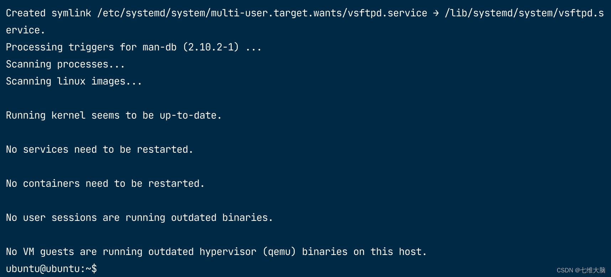
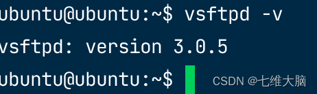

Ubuntu 系统版本：Ubuntu 22.04.2 LTS

安装 vsftpd 软件包
sudo apt-get update
sudo apt-get install vsftpd



查看版本，验证是否安装成功：vsftpd -v



配置文件
以下是我翻译后的默认配置文件（地址 /etc/vsftpd.conf）：


```
# 示例配置文件，地址： /etc/vsftpd.conf

#

# vsftpd的默认编译设置比较谨慎，这个示例文件会放宽一些限制，使ftp服务更加易用。

# 同时建议查看vsftpd.conf.5文件以了解所有编译默认值。

#

# 特别提醒：这个示例文件并不包含vsftpd选项的所有内容，建议阅读vsftpd.conf.5手册页以充分了解vsftpd的功能。

#
#
# 

# 用来设置vsftpd是否以独立守护进程运行。

# 如果设置为"listen=YES"，则表示vsftpd将作为独立守护进程运行；

# 如果设置为"listen=NO"，则表示vsftpd将不会以独立守护进程运行，而是通过inetd或者initscript启动。

listen=NO
#

# 设置vsftpd是否启用IPv6监听。

# 如果设置为"listen_ipv6=YES"，则表示vsftpd将启用IPv6监听；

# 如果设置为"listen_ipv6=NO"，则表示vsftpd将不会启用IPv6监听。

# 默认情况下，IPv6监听地址为"::"，同时可以接受IPv6和IPv4客户端的连接。

# 如果你只需要监听IPv4或IPv6地址，则不需要同时启用两种监听，如果你需要同时监听特定的IPv4和IPv6地址，则需要运行两个vsftpd实例，并使用两个不同的配置文件来进行配置。

listen_ipv6=YES
#

# 设置是否允许匿名FTP登录。

anonymous_enable=NO
#

# 设置是否允许本地用户登录FTP服务器。

local_enable=YES
#

# 设置是否允许FTP用户执行写入操作。

# write_enable=YES

#

# 设置本地用户的默认umask值。

# umask是一个三位八进制数，用来控制新建文件或目录的访问权限。

# 在FTP服务器中，local_umask选项用来设置本地用户上传文件或创建目录时的默认权限。

# 默认情况下，local_umask的值为077，表示新建的文件或目录权限为只有所有者可读、可写、可执行，其他用户无权访问。

# 如果你的用户希望默认权限为所有者可读、可写、可执行，其他用户可读、可执行，则可以将local_umask的值设置为022。

local_umask=022
#

# 设置是否允许匿名FTP用户上传文件。

# 如果将该选项的注释去掉（即将“#”删去），并将其值设置为YES，则表示允许匿名FTP用户上传文件。

# 但是，这个选项只有在全局写入权限被激活时才会生效。此外，你还需要创建一个由FTP用户可写的目录，以便匿名FTP用户可以上传文件。

# 需要注意的是，开启匿名FTP用户上传文件功能可能存在一定的安全风险，因此需要谨慎使用。

# anon_upload_enable=YES

#

# 设置是否允许匿名FTP用户创建新目录。

# 如果将该选项的注释去掉（即将“#”删去），并将其值设置为YES，则表示允许匿名FTP用户创建新目录。

# 需要注意的是，开启匿名FTP用户创建新目录功能可能存在一定的安全风险，因此需要谨慎使用。

# anon_mkdir_write_enable=YES

#

# 这段配置文件是用来设置是否启用目录消息功能。

# 如果设置为YES，则表示启用目录消息功能。当远程用户进入某个目录时，会显示该目录的消息。

dirmessage_enable=YES
#

# 设置是否启用本地时间功能。

# 启用本地时间功能后，vsftpd将会在目录列表中显示本地时间而非GMT时间。

use_localtime=YES
#

# 启用上传和下载日志记录功能。

# 启用该功能后，vsftpd会记录每个用户的上传和下载操作，并将其记录到指定的日志文件中。

xferlog_enable=YES
#

# 设置数据传输的端口号。

# 将其值设置为YES，则表示数据传输使用的端口号为20。

connect_from_port_20=YES
#

# 设置匿名用户上传的文件的所有者。

# 设置为YES，则表示上传的文件将会被转换为指定用户的所有权。

# chown_uploads=YES

# 设置为指定的用户名。

# chown_username=whoever

#

# 设置vsftpd日志文件的路径。该路径必须具有可写权限，并且对于vsftpd进程来说，必须具有可访问权限。

# xferlog_file=/var/log/vsftpd.log

#

# 设置vsftpd日志文件的格式。设备为YES则存储为标准ftpd xferlog格式。

# xferlog_std_format=YES

#

# 设置vsftpd空闲会话超时的时间（以秒为单位）。

# idle_session_timeout=600

#

# 设置vsftpd数据连接超时的时间（以秒为单位）。

# data_connection_timeout=120

#

# vsftpd建议在系统中定义一个唯一的用户，供FTP服务器使用，作为完全隔离和无特权的用户。

# nopriv_user选项可以用来指定该用户的用户名。

# nopriv_user=ftpsecure

#

# 用于启用异步ABOR请求的识别。

# 异步ABOR请求是一种FTP客户端请求，用于取消当前正在进行的数据传输操作。

# 启用该选项可以提高FTP服务器的性能，但也会增加安全风险。因为异步ABOR请求的代码比较复杂，可能会被黑客利用进行恶意攻击。

# 所以，如果安全性是首要考虑因素，则不建议启用该选项。

# async_abor_enable=YES

#

# 用于控制FTP服务器是否启用ASCII模式下的文件转换功能。

# 默认情况下，FTP服务器会假装允许ASCII模式，但实际上会忽略该请求。

# 如果需要启用ASCII模式下的文件转换功能，则可以将ascii_upload_enable和ascii_download_enable选项的注释去掉，并将它们的值设置为YES。

# 在ASCII模式下，FTP服务器会将文本文件中的换行符和回车符进行转换，以便在不同操作系统之间进行传输。

# 但是，需要注意的是，ASCII模式下可能存在一些安全风险。例如，攻击者可以利用SIZE命令在ASCII模式下发送一个超大文件名，导致FTP服务器崩溃。

# 因此，建议谨慎使用ASCII模式，并确保FTP服务器已经做好了相应的安全措施。

# ascii_upload_enable=YES

# ascii_download_enable=YES

#

# vsftpd的登录横幅的设置，你可以理解为登录成功后的欢迎词。

# ftpd_banner=Welcome to blah FTP service.

#

# 设备是否拒绝匿名电子邮件地址

# 有助于减轻利用匿名访问FTP服务器进行的拒绝服务（DoS）攻击。如果检测到被禁止的电子邮件地址，服务器将拒绝该用户的访问。

# deny_email_enable=YES

# 如果启用了拒绝匿名电子邮件地址的选项，则通过从指定的文件“/etc/vsftpd.banned_emails”读取被禁止的电子邮件地址列表。

# banned_email_file=/etc/vsftpd.banned_emails

#

# 设备限制本地用户仅访问其home目录。

# 如果启用，则本地用户将仅访问其home目录和其子目录，无法访问其他目录。

# chroot_local_user=YES

#

# 是否允许本地用户，是否将本地用户限制在其主目录中，如果设置为YES，则不会将列在chroot_list_file中的用户限制在其主目录中。

# chroot_local_user=YES

# 是否启用chroot_list_file列表，用于指定哪些用户不应该被限制在主目录中。

# chroot_list_enable=YES

# 指定了chroot_list_file列表的路径和名称。一行一个用户名。

# chroot_list_file=/etc/vsftpd.chroot_list

#

# 否启用ls命令的递归选项“-R”，该选项可以在列出目录内容时递归地列出子目录。

# 默认情况下，该选项被禁用以避免远程用户在大型站点上引起过多的I/O。

# ls_recurse_enable=YES

#

# 自定义配置：

#

# 指定了一个空目录作为安全chroot() jail。

# 在某些情况下，vsftpd不需要访问文件系统，因此可以将FTP用户限制在这个空目录中，以增强安全性。该目录应该为空，并且不应该被FTP用户写入。

secure_chroot_dir=/var/run/vsftpd/empty
#

# 指定vsftpd将使用的PAM服务的名称。

# 默认情况下，pam_service_name的值为“vsftpd”，这意味着vsftpd将使用名为“vsftpd”的PAM服务来进行认证。

# 如果需要使用其他的PAM服务，可以修改该选项的值。

pam_service_name=vsftpd
#

# 用于指定在SSL加密连接中使用的RSA证书的位置。

# 通过设置rsa_cert_file和rsa_private_key_file选项来指定RSA证书和私钥的位置。

# 其中，rsa_cert_file选项用于指定证书文件的位置，而rsa_private_key_file选项用于指定私钥文件的位置。

rsa_cert_file=/etc/ssl/certs/ssl-cert-snakeoil.pem
rsa_private_key_file=/etc/ssl/private/ssl-cert-snakeoil.key

# 是否启用SSL加密连接。

ssl_enable=NO
#

# 指定是否在vsftpd中使用UTF-8编码的文件系统。

# utf8_filesystem=YES


```


# 


# 一般情况下这样设置一下就可以了，配置文件已经翻译好了，大家可以按需设置：（编辑配置文件命令：sudo vim /etc/vsftpd.conf）


local_enable=YES
write_enable=YES
chroot_local_user=YES
chroot_list_enable=YES
chroot_list_file=/etc/vsftpd.chroot_list

也可以加上这段配置（路径可以自定义）：

# 设置FTP用户的本地根目录，也就是说，FTP用户登录后，其工作目录将被限制在该目录及其子目录下。
local_root=/data/liss/data
1
2
以下是设置截图（后面还有，按需配置）：

————————————————
版权声明：本文为CSDN博主「七维大脑」的原创文章，遵循CC 4.0 BY-SA版权协议，转载请附上原文出处链接及本声明。
原文链接：https://blog.csdn.net/weixin_52799373/article/details/131045373